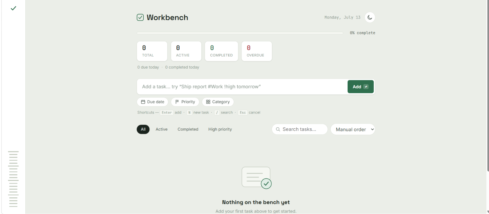
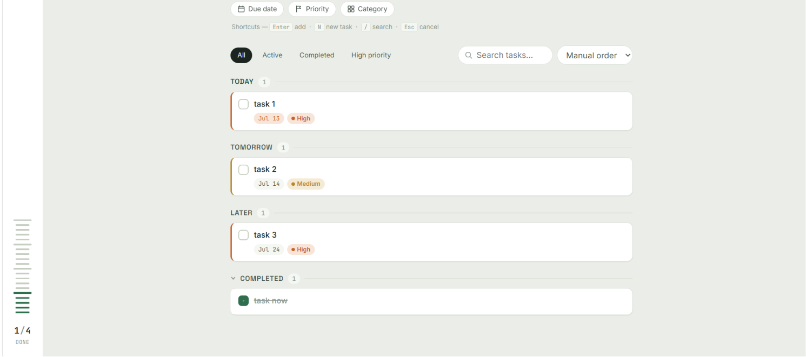

<div align="center">

# Workbench

**A fast, keyboard-friendly task manager that runs entirely in your browser — no backend, no build step, no tracking.**

[](#)
[](#)
[](#)
[](#)
[](LICENSE)

[Live Demo](https://keerthana-dev6.github.io/minimal-to-do-list/) · [Features](#-features) · [Getting Started](#-getting-started) · [Keyboard Shortcuts](#-keyboard-shortcuts)

</div>

<br/>

<p align="center">
  
  <br/><br/>
  
</p>

## About

Workbench is a single-page task manager built with plain HTML, CSS, and JavaScript — no frameworks, no build tools, no dependencies to install. It's designed to feel closer to a lightweight Notion/Linear/Todoist-style productivity tool than a typical to-do list demo: smart quick-add parsing, automatic due-date grouping, drag-to-reorder, color-coded categories, and a dark/light theme, all backed by `localStorage` so your data stays on your machine.

It started as a portfolio project to explore clean state management and interaction design in vanilla JavaScript — no React, no Vue, just the DOM.

## ✨ Features

**Task management**
- Add, edit, complete, and delete tasks with full undo support
- Rich task details: description, due date, priority, category, and subtasks
- Inline quick-rename (click a title to edit it) and a full edit modal for everything else
- Confirmation prompt before deleting, plus a 5-second "Undo" toast after

**Smart quick-add**
- Type naturally and Workbench parses it for you:
  `Ship report #Work !high tomorrow` → title, category, priority, and due date are all set automatically
- Supports `today`, `tomorrow`, `next week`, and weekday names (`mon`, `tue`, …)

**Organization**
- Tasks automatically group into **Overdue / Today / Tomorrow / This week / Later / No date**
- Filter by All / Active / Completed / High priority / any category
- Search across titles, descriptions, and category names
- Sort manually (drag-and-drop), by priority, by due date, or newest-first
- Manual reordering works with mouse, trackpad, *and touch* (built on Pointer Events, not the old HTML5 drag API)

**Progress at a glance**
- Live stats: Total, Active, Completed, Overdue, plus due-today / completed-today
- A linear progress bar with completion percentage
- A signature "ruler" progress rail — a tick-mark meter that fills as you complete tasks

**Personalization**
- Dark / light theme toggle, remembers your choice, and respects your OS preference on first visit
- No flash-of-wrong-theme on page load

**Details that matter**
- Toast notifications for add / edit / complete / delete / restore
- Empty states with helpful guidance instead of a blank screen
- Fully responsive: distinct layouts for mobile, tablet, and desktop
- Keyboard shortcuts for the whole add/search/cancel flow
- Built with accessibility in mind: proper ARIA roles, focus-trapped modals, `prefers-reduced-motion` support

## 🛠 Tech Stack

| | |
|---|---|
| Markup | Semantic HTML5 |
| Styling | CSS3 — custom properties for theming, no preprocessor, no framework |
| Logic | Vanilla JavaScript (ES5-compatible syntax, no transpiler needed) |
| Storage | Browser `localStorage` — all data stays on your device |
| Fonts | [Space Grotesk](https://fonts.google.com/specimen/Space+Grotesk), [Inter](https://fonts.google.com/specimen/Inter), [JetBrains Mono](https://fonts.google.com/specimen/JetBrains+Mono) via Google Fonts |

No npm install, no bundler, no framework — open the file and it runs.

## 📁 Project Structure

```
minimal-to-do-list/
├── index.html         # Markup, theme bootstrap script, modal/toast containers
├── style.css          # Design tokens (light + dark), layout, animations
├── script.js          # State, rendering, drag-and-drop, storage, all app logic
├── home-page.png       # Screenshot used in this README
├── task-page.png        # Screenshot used in this README
├── LICENSE
└── README.md
```

## 🚀 Getting Started

Clone the repo:

```bash
git clone https://github.com/keerthana-dev6/minimal-to-do-list.git
cd minimal-to-do-list
```

**Serve it locally rather than double-clicking `index.html`.** Some browsers (Safari in particular) restrict `localStorage` on `file://` pages, which would stop your tasks from saving. Any of these work:

```bash
# Python
python -m http.server 8000

# Node
npx serve

# Or use the "Live Server" extension in VS Code
```

Then open `http://localhost:8000` (or whatever port your tool prints) in your browser.

## ⌨️ Keyboard Shortcuts

| Key | Action |
|---|---|
| `Enter` | Add the task in the quick-add bar |
| `N` | Focus the quick-add input from anywhere |
| `/` | Focus search |
| `Esc` | Close a popover/modal, or cancel an in-progress edit |

## 🎨 Customization

All colors, spacing, and typography are driven by CSS custom properties at the top of `style.css`, split into a light theme block (`:root`) and a dark theme block (`[data-theme="dark"]`). Changing the palette is a matter of editing those variables — no need to touch component styles.

```css
:root {
  --accent: #2F6F4E;   /* primary brand color */
  --bg: #EBEEE8;        /* page background */
  --surface: #FFFFFF;    /* cards, inputs, popovers */
  /* ...etc */
}
```

## 🗺 Roadmap

- [ ] Export / import tasks as JSON
- [ ] Recurring tasks
- [ ] Optional cloud sync (currently local-only by design)
- [ ] Bulk actions (multi-select complete/delete)

## 🤝 Contributing

This is primarily a personal/portfolio project, but issues and pull requests are welcome — feel free to open one if you spot a bug or have an idea.

## 📄 License

Released under the [MIT License](LICENSE).

## 👤 Author

**Keerthana**
B.Tech CSE · [GitHub @keerthana-dev6](https://github.com/keerthana-dev6)

<div align="center">
<sub>Built with plain HTML, CSS, and JavaScript — no frameworks required.</sub>
</div>
